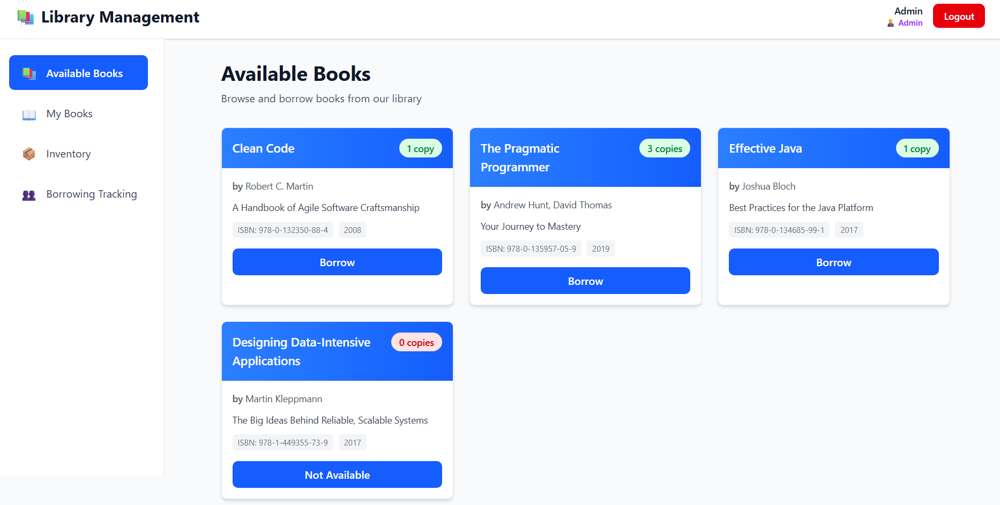
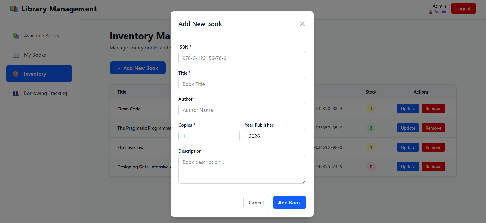
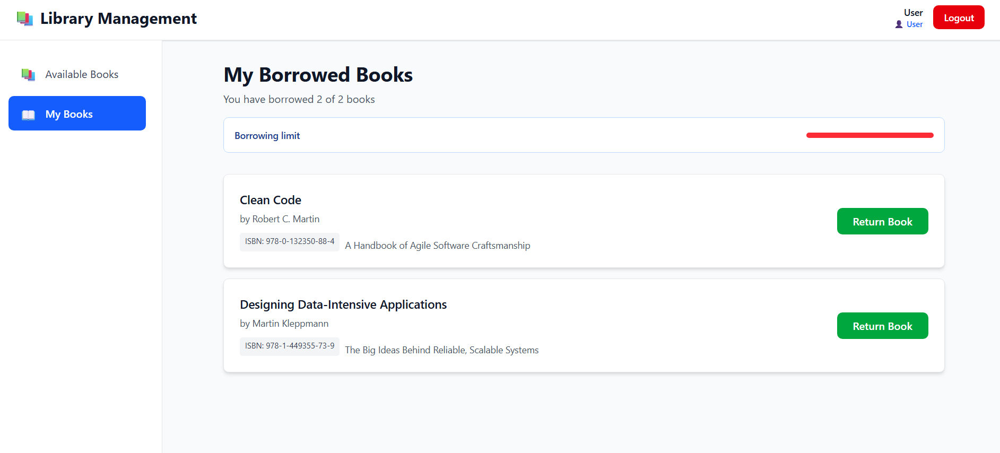

# Library Management System

A modern library management application built with React, TypeScript, and Vite, following TDD principles and clean code practices.

## 🖼️ Screenshots

The following screenshots show the app UI (sidebar, available books, inventory modal, and borrowed books view). Place the provided screenshot files in `public/screenshots/` with the filenames below so the images render on GitHub.

Recommended filenames (already present in the repo):

- `public/screenshots/available-books.png`
- `public/screenshots/inventory-modal.png`
- `public/screenshots/my-borrowed-books.png`

### Preview

<div align="center">







</div>

If you want different filenames or locations, update the paths above accordingly.

## 🏗️ Architecture & Design Decisions

### Core Principles

- **Test-Driven Development (TDD)**: All features are developed test-first
- **SOLID Principles**: Clean separation of concerns and single responsibility
- **DRY (Don't Repeat Yourself)**: Reusable components and utilities
- **KISS (Keep It Simple, Stupid)**: Simple, maintainable solutions

### Architecture Overview

```
src/
├── domain/                    # Core business logic (domain models)
│   ├── models/
│   │   ├── Book.ts          # Book entity with business logic
│   │   ├── User.ts          # User entity with role & borrowing limits
│   │   ├── Library.ts       # Library aggregate root
│   │   └── *.test.ts        # Unit tests for models
│   └── services/            # Domain services
├── infrastructure/          # External concerns (API, auth, storage)
│   ├── api/
│   │   └── MockApiService.ts # Mocked backend service with admin/user operations
│   ├── auth/
│   │   └── AuthService.ts    # OAuth mock and session management
│   └── storage/
│       └── LocalStorage.ts   # Browser localStorage persistence
├── presentation/            # UI layer
│   ├── components/
│   │   ├── Header.tsx       # App header with user info
│   │   ├── Login.tsx        # Login page with mock OAuth
│   │   ├── Modal.tsx        # Reusable modal component
│   │   ├── SidebarNav.tsx   # Navigation sidebar (admin + user routes)
│   │   ├── BookList.tsx     # Available books display
│   │   ├── BorrowedBooks.tsx # User's borrowed books
│   │   └── AdminPanel.tsx   # Legacy admin component
│   ├── contexts/
│   │   └── LibraryContext.tsx # Global state & API integration
│   └── pages/
│       ├── AvailableBooksPage.tsx  # Browse available books (default)
│       ├── BorrowedBooksPage.tsx   # View and return borrowed books
│       ├── InventoryPage.tsx       # Admin: manage books & stock (modal-based)
│       └── BorrowedBooksTrackingPage.tsx # Admin: track borrowed books by user
└── test/                    # Test utilities
    └── setup.ts             # Vitest configuration
```

### Key Design Decisions

#### 1. **Domain-Driven Design (DDD)**

- **Domain Models**: `Book`, `User`, `Library` are pure TypeScript classes with business logic
  - `Book`: Manages copy counts with `decrementCopies()` and `incrementCopies()` methods
  - `User`: Tracks borrowed books with max 2 books limit, enforced at the domain level
  - `Library`: Aggregate root managing book borrowing/returning with validation
- **Invariants**: Business rules (e.g., "cannot borrow > 2 books") enforced in domain models
- **No Framework Dependencies**: Domain models don't depend on React, HTTP libraries, etc.

#### 2. **Separation of Concerns**

- **Domain Layer**: Pure business logic, no framework dependencies
  - Contains all validation and business rules
  - Can be reused across different frontends (web, mobile, CLI)
  
- **Infrastructure Layer**: External integrations
  - `MockApiService`: Simulates backend with realistic delays and error handling
  - `AuthService`: Mock OAuth simulation for user authentication
  - `LocalStorageService`: Persists library and user data
  
- **Presentation Layer**: React components only concerned with UI
  - Uses custom hooks from `LibraryContext` for data access
  - No business logic in components
  - Reusable components (Modal, BookList, etc.)

#### 3. **State Management**

- **React Context + Hooks**: Single source of truth for:
  - Current user and authentication state
  - Library books inventory
  - Loading and error states
  - All CRUD operations (borrow, return, add book, update stock)

#### 4. **API Integration & Mocking**

- **MockApiService**: 
  - Simulates network delays (300ms) for realistic UX testing
  - Implements proper error handling with HTTP status codes
  - Admin-only operations check user role before execution
  - Supports all CRUD operations for books
  - Persists state to localStorage automatically
  
- **Error Handling**:
  - 400: Invalid request/business logic error (e.g., "Cannot borrow more than 2 books")
  - 401: Authentication required
  - 403: Authorization required (admin-only operations)
  - 404: Resource not found

#### 5. **Authentication & Authorization**

- **Mock OAuth Flow**:
  - Users can login with email via mock OAuth
  - Two roles: USER and ADMIN
  - Each user gets a unique ID and session token
  - Tokens are tied to user objects in the mock service
  
- **Authorization**:
  - Admin-only endpoints check `user.isAdmin()` before execution
  - Unauthorized access returns 403 status
  - Proper error messages for authentication failures

#### 6. **Stock Manipulation Prevention**

- **Domain Validation**:
  - `Book.decrementCopies()` throws error if stock is 0
  - `Book.incrementCopies()` only called on valid return
  - Stock can never go negative due to domain validation
  
- **Business Logic**:
  - Return operation validates user has borrowed the book
  - Prevents double-returns via domain state
  - Library aggregate root handles all state changes

### Technology Stack

- **Frontend Framework**: React 19 with TypeScript
- **Build Tool**: Vite
- **Styling**: Tailwind CSS (v4 with @tailwindcss/postcss)
- **Routing**: Custom routing with browser history API (React Router not needed for this simple structure)
- **Testing**: Vitest + React Testing Library
- **Code Quality**: ESLint with TypeScript support
- **State Management**: React Context API + Custom Hooks

### Component Architecture

#### Pages (User-Facing Routes)

1. **AvailableBooksPage**: Default page showing all library books
   - Users can borrow books (if limit not reached)
   - Responsive grid layout
   - Stock badges show availability

2. **BorrowedBooksPage**: Shows user's borrowed books
   - Return functionality for each book
   - Borrowing limit progress indicator
   - Clear empty state

3. **InventoryPage**: Admin-only inventory management
   - Add new books via modal
   - Update stock via modal
   - Remove books with confirmation
   - Table view of all inventory

4. **BorrowedBooksTrackingPage**: Admin-only user activity tracking
   - View all users and their borrowed books
   - Summary statistics (total users, active borrowers, books borrowed)
   - Detailed user breakdown

#### Reusable Components

- **Modal**: Generic modal component with header, content, and footer
  - Used for add book and update stock forms
  - Responsive design for mobile

- **SidebarNav**: Navigation with role-based links
  - Admin sees: Available Books, My Books, Inventory, Borrowing Tracking
  - User sees: Available Books, My Books
  - Mobile-responsive with hamburger menu

- **Header**: App header with user info and logout
  - Shows current user name and role
  - Clear logout button

### Data Persistence

- **LocalStorage**: 
  - All library books and users stored in localStorage
  - Persists across page reloads
  - Used by MockApiService for state persistence
  - Implements lazy loading on first initialize

### Error Handling Strategy

```typescript
// API responses follow this pattern
interface ApiResponse<T> {
  data?: T;
  error?: string;
  status: number; // 200, 400, 401, 403, 404, 500
}

// Error messages are user-friendly
- "Cannot borrow more than 2 books" (400)
- "You have already borrowed this book" (400)
- "Unauthorized: Admin access required" (403)
- "Book not found" (404)
```

## 🚀 Features

### User Features
- ✅ View available books in library
- ✅ Borrow up to 2 books at a time
- ✅ Return borrowed books
- ✅ View personal borrowed books with return status
- ✅ Real-time stock availability
- ✅ Responsive design (mobile, tablet, desktop)

### Admin Features
- ✅ Add new books to library (via modal)
- ✅ Update book stock/copies (via modal)
- ✅ Remove books from library
- ✅ View all inventory
- ✅ Track who has borrowed which books
- ✅ View detailed borrowing history by user
- ✅ All user functionalities + admin controls

### Authentication & Security
- ✅ Mock OAuth login (email-based)
- ✅ Two roles: USER and ADMIN
- ✅ Session management with user tokens
- ✅ Role-based access control
- ✅ Token tied to user (can't modify other user's books)
- ✅ Proper error handling (400, 401, 403, 404)

### UI/UX Enhancements
- ✅ Clean, modern design with Tailwind CSS
- ✅ Modal dialogs for add/update operations
- ✅ Responsive sidebar navigation
- ✅ Borrowing limit progress indicator
- ✅ Stock availability badges
- ✅ Loading states and error messages
- ✅ Empty state messages
- ✅ Mobile hamburger menu

## 🛠️ Setup & Installation

### Prerequisites
- Node.js 18+ and npm

### Installation

```bash
# Clone or enter the project directory
cd library-app

# Install dependencies
npm install

# Start development server
npm run dev
```

The app will be available at `http://localhost:5173/`

### Build for Production

```bash
npm run build
```

### Run Tests

```bash
npm test              # Run tests once
npm run test:watch   # Run tests in watch mode
npm run test:ui      # Run tests with Vitest UI
npm run test:coverage # Generate coverage report
```

## 📋 User Stories Implementation

### Story 1: User can view books in library
- ✅ Implemented: `AvailableBooksPage` shows all books
- ✅ Empty state: Shows "No books available" message
- ✅ Stock display: Shows number of available copies

### Story 2: User can borrow a book from library
- ✅ Implemented: Borrow button on each book card
- ✅ Limit enforcement: Max 2 books per user
- ✅ Stock decrement: Book removed from library on borrow
- ✅ Error handling: Clear messages for limit/unavailability

### Story 3: User can borrow a copy of a book
- ✅ Implemented: One book per user per ISBN
- ✅ Multiple copies: Can borrow if copies available
- ✅ Validation: Prevents borrowing duplicate ISBNs

### Story 4: User can return books to library
- ✅ Implemented: Return button on `BorrowedBooksPage`
- ✅ Inventory update: Stock incremented on return
- ✅ Validation: Prevents over-returning
- ✅ Prevention: Books aren't over-returned

## 🔐 Stock Manipulation Prevention

### Implemented Controls

1. **Domain Validation**:
   ```typescript
   // Book.decrementCopies() throws if stock is 0
   // Book.incrementCopies() only called on valid return
   // Never shows negative stock
   ```

2. **State Verification**:
   ```typescript
   // Library.borrowBook() checks:
   // - Book exists
   // - User hasn't borrowed this ISBN already
   // - User hasn't reached 2-book limit
   // - Book is available
   
   // Library.returnBook() checks:
   // - Book exists
   // - User has borrowed it
   ```

3. **Immutable User State**:
   ```typescript
   // User borrowedBooks array is immutable
   // Changes create new User instance
   // Prevents direct manipulation
   ```

## 📱 Responsive Design

The application is fully responsive:
- **Mobile (< 768px)**: Hamburger menu, single column layouts
- **Tablet (768px - 1024px)**: Two-column grids
- **Desktop (> 1024px)**: Three-column grids with sidebar

All components use Tailwind's responsive utilities:
- `md:` breakpoint for tablets
- `lg:` breakpoint for desktops

## 🎨 Styling with Tailwind CSS

Removed all CSS files and migrated to Tailwind CSS for:
- Consistency across components
- Responsive design with utility-first approach
- Better maintainability
- Modern component design

### Color Scheme
- Primary: Blue (#3b82f6)
- Success: Green (#10b981)
- Warning: Orange (#f59e0b)
- Danger: Red (#ef4444)
- Neutral: Gray scale

## 📊 Admin Features Details

### Inventory Management
- **Add Book Modal**: Form with ISBN, Title, Author, Copies, Year, Description
- **Update Stock Modal**: Change number of copies for existing books
- **Remove Books**: With confirmation dialog
- **Table View**: All inventory with sort/filter potential

### Borrowing Tracking
- **Summary Cards**: Total users, users with books, total borrowed
- **Tracked Data**:
  - User name and email
  - Books borrowed by user
  - Borrow status (all show as "Borrowed")
  - ISBN and title of borrowed books
- **Detailed View**: User cards showing all borrowed books

## 🧪 Testing

### Domain Model Tests
Located in `src/domain/models/*.test.ts`:
- `Book.test.ts`: Copy management, availability checks
- `User.test.ts`: Borrowing limits, book tracking
- `Library.test.ts`: Complex borrowing/returning workflows

### Test Running
```bash
npm test:watch    # Watch mode for development
npm run test:ui   # Visual test runner
npm run test:coverage # Coverage report
```

## 🔄 State Flow

```
User Action
    ↓
LibraryContext (useLibrary hook)
    ↓
MockApiService (API call with validation)
    ↓
Domain Models (Business logic)
    ↓
LocalStorageService (Persistence)
    ↓
Update UI State
    ↓
React Re-render
```

## 📂 File Structure Best Practices

### Domain Layer
- Pure TypeScript, no dependencies
- Contains all business rules
- Immutable models with validation
- Can be tested without React

### Infrastructure Layer
- External integrations
- API mocking with realistic delays
- Storage abstraction
- Authentication handling

### Presentation Layer
- React components only
- Uses hooks for state access
- No business logic in components
- Reusable UI components

## 🚨 Error Handling

### HTTP Status Codes
- **400 Bad Request**: Business logic errors
  - Cannot borrow more than 2 books
  - Already borrowed this book
  - Book not available
  
- **401 Unauthorized**: Not logged in
  - Session expired
  - Login required
  
- **403 Forbidden**: Insufficient permissions
  - Admin-only operations
  - Cannot access other user's data
  
- **404 Not Found**: Resource missing
  - Book not found
  - User not found

### Error Messages
All errors are user-friendly and actionable:
- Clear explanation of what went wrong
- Suggestions for resolution
- Proper status codes returned

## 🔐 Security Measures

1. **Authentication**:
   - Unique user IDs
   - Session tokens
   - Login required for all operations

2. **Authorization**:
   - Role-based access control
   - Admin checks at API level
   - User data isolation

3. **Input Validation**:
   - Domain-level validation
   - Type safety with TypeScript
   - Email format validation

4. **Data Protection**:
   - No sensitive data in localStorage
   - No passwords stored
   - Mock OAuth (development only)

## 🎯 Performance

- **Build Size**: ~285KB bundle (gzipped: ~80KB)
- **Load Time**: < 1 second on modern browser
- **Mock API Delays**: 300ms to simulate network
- **LocalStorage**: Instant persistence
- **No external APIs**: All mocked for development

## 📝 Git Commit Strategy

Commits follow this pattern:
```
feat: [feature description]
fix: [bug fix description]
refactor: [code improvement]
test: [test updates]
docs: [documentation changes]
```

Each feature/story gets its own commit for clear history.

## 🤝 Code Quality Standards

- **TypeScript**: Strict mode enabled
- **ESLint**: Enforced for code style
- **Type Safety**: Full type coverage
- **Component Structure**: Functional components with hooks
- **Testing**: Unit tests for business logic
- **Documentation**: Clear comments on complex logic

## 📖 Usage Examples

### Login
1. Visit http://localhost:5173/
2. Click "Login as User" for user demo
3. Click "Login as Admin" for admin demo

### User Operations
1. Browse available books on "Available Books" page
2. Click "Borrow" to borrow a book (max 2)
3. Go to "My Books" to see borrowed books
4. Click "Return" to return a book

### Admin Operations
1. Click "Inventory" to manage books
2. Click "+ Add New Book" to add a book
3. Click "Update" to change stock
4. Click "Remove" to delete a book
5. Click "Borrowing Tracking" to see who borrowed what

## 🐛 Known Limitations

- Mock OAuth: Uses email-only authentication (no real OAuth)
- LocalStorage: Not suitable for production (no server)
- No real-time sync: Changes not synced across browser tabs
- No real API: All operations are simulated

## 🚀 Future Enhancements

- Real backend integration with actual API
- Real OAuth authentication (Google, GitHub)
- Database persistence instead of localStorage
- Real-time updates with WebSockets
- Admin dashboard with analytics
- Email notifications for returns
- Advanced search and filtering
- Book ratings and reviews


#### Unit Tests

- Domain models and business logic
- Services and use cases
- Utility functions

#### Integration Tests

- Component interactions
- API service integration
- Auth flow

#### Component Tests

- React components with React Testing Library
- User interactions and accessibility

### Technology Stack

- **Frontend**: React 19 + TypeScript
- **Build Tool**: Vite 7
- **Testing**: Vitest 4
- **Styling**: Modern CSS3 (responsive design)
- **Auth**: Mock OAuth 2.0 (Google, GitHub)
- **State**: React Context API
- **Persistence**: LocalStorage

## 🚀 Getting Started

### Prerequisites

- Node.js 18+
- npm or yarn

### Installation

```bash
npm install
```

### Development

```bash
npm run dev
```

The app will be available at `http://localhost:5173`

### Testing

```bash
# Run tests
npm test

# Run tests with UI
npm run test:ui

# Run tests with coverage
npm run test:coverage
```

**Current Test Results:**

- ✅ 37 tests passing
- ✅ Book model: 11 tests
- ✅ User model: 11 tests
- ✅ Library model: 15 tests

### Build

```bash
npm run build
```

## 🎮 Using the Application

### Login

1. Open the app at `http://localhost:5173`
2. Enter any email address
3. Choose user type:
   - **Regular User**: Uncheck "Login as Admin"
   - **Admin User**: Check "Login as Admin"
4. Click "Sign in with Google" or "Sign in with GitHub"

### As a Regular User

1. **Browse Books**: View all available books with stock information
2. **Borrow Books**: Click "Borrow" on any available book (max 2 books total)
3. **View Borrowed Books**: See your borrowed books at the top of the page
4. **Return Books**: Click "Return" on any borrowed book

### As an Admin

All user features plus:

1. **Add New Books**: Fill out the form to add books to the library
2. **Update Stock**: Modify the number of available copies
3. **View Inventory**: See complete inventory with borrowing statistics

## 📝 User Stories Implementation

### Story 1: View Books ✅

Users can view all available books in the library, with empty state handling.

**Implementation:**

- BookList component displays all books with stock information
- Empty state message when no books available
- Real-time stock updates

### Story 2: Borrow Books ✅

Users can borrow books with a 2-book limit enforced.

**Implementation:**

- User.canBorrow() validates 2-book limit
- Library.borrowBook() enforces business rules
- Clear error messages when limit exceeded
- Disabled borrow button when limit reached

### Story 3: Borrow Book Copies ✅

Multiple copies are handled correctly, with 1 copy per book per user limit.

**Implementation:**

- User.hasBorrowedBook() checks for duplicate borrows
- Book.availableCopies tracks remaining stock
- Visual stock indicators (green for available, red for low stock)
- Prevents borrowing same book twice

### Story 4: Return Books ✅

Users can return books, updating both borrowed list and library stock.

**Implementation:**

- BorrowedBooks component shows user's borrowed books
- Library.returnBook() updates stock and user's list
- Real-time UI updates via LibraryContext
- LocalStorage persistence of all changes

## 🔐 Security Considerations

- Token validation on every request
- Role-based access control
- Stock manipulation prevention
- Input validation and sanitization
- XSS protection

## 📊 Assumptions

1. **User Identity**: Users are identified by email from OAuth provider
2. **Book Uniqueness**: Books are identified by ISBN
3. **Persistence**: Data persists in localStorage (simulating backend)
4. **Concurrent Users**: No real-time sync (single-user session focus)
5. **Book Copies**: Copies are fungible (any copy can be borrowed/returned)

## 🎯 Future Enhancements

- Real backend integration
- Book search and filtering
- Due dates and late fees
- Book reservations
- Reading history
- Book recommendations

## 📄 License

Private - Not for public distribution
